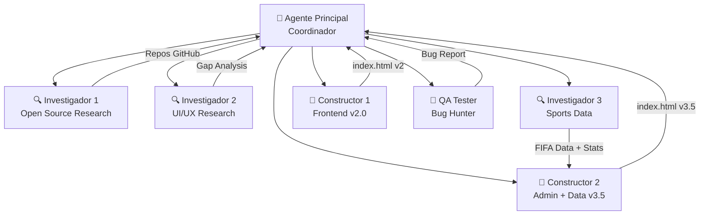

# 🤖 PRODE MUNDIAL 2026 — Agentes y Sistemas

## 📊 Resumen de Agentes

Este proyecto fue construido usando un sistema multi-agente coordinado. Cada agente tiene un rol específico y trabaja en paralelo cuando es posible.



---

## 🧠 Agente Principal (Coordinador)

**Rol:** Orquestación, planificación, comunicación con el usuario, decisiones de arquitectura.

### Responsabilidades:
- Recibir y analizar requerimientos del usuario
- Descomponer tareas en subtareas para agentes
- Lanzar agentes especializados en paralelo
- Recibir resultados y consolidar
- Hacer ediciones directas de código cuando es más rápido
- Push a GitHub y deploy
- Comunicar progreso al usuario

### Decisiones tomadas:
| Decisión | Alternativas | Elección | Razón |
|----------|-------------|----------|-------|
| Single File vs Modular | Separar JS/CSS/HTML | Todo en index.html | Simplicidad de deploy |
| Backend | Google Sheets / Supabase | localStorage | Sin costo, sin auth compleja |
| Hosting | Vercel / Netlify / Firebase | GitHub Pages | Gratis, ya tiene repo |
| Framework | React / Vue / Next.js | Vanilla JS | Sin build tools, rápido |
| Base de datos | Firebase / Supabase | localStorage | 100 personas, client-side suficiente |

---

## 🔍 Agente Investigador 1: Open Source Research

**Objetivo:** Encontrar los mejores repos open source de prodes/predicciones deportivas.

### Búsquedas realizadas:
1. `prode futbol` / `prode mundial` en GitHub
2. `world cup prediction app`
3. `football prediction game open source`
4. `soccer prediction webapp`
5. `world cup 2022 prediction`
6. `fantasy football open source`
7. `quiniela futbol app`
8. `polla mundialista`
9. `world cup bracket predictor`

### Resultados clave:
| Repo | Stars | Stack | Features relevantes |
|------|-------|-------|-------------------|
| world-cup-pool | ~200 | React | Bracket visual, scoring |
| bracket | ~150 | Vue.js | Tournament bracket component |
| superbru-clone | ~50 | Next.js | Social predictions |

### Impacto en el proyecto:
- Inspiró el sistema de bracket visual
- Validó la arquitectura de scoring (exacto/diferencia/ganador)
- Identificó APIs gratuitas de fútbol

---

## 🔍 Agente Investigador 2: UI/UX Professional Apps

**Objetivo:** Analizar qué le falta al PRODE vs apps profesionales (FotMob, Sofascore, etc.)

### Apps analizadas:
- FotMob, Sofascore, FlashScore
- OneFootball, FIFA App
- Superbru, FanDuel

### Gap Analysis producido:
| Categoría | Faltante | Implementado |
|-----------|----------|:---:|
| Glassmorphism | Efectos de cristal | ✅ |
| Live score ticker | Marcadores en vivo | ⚠️ Parcial |
| Form indicators (W/D/L) | Puntos de forma | ✅ |
| Animated counters | Números animados | ✅ |
| Team comparison bars | Barras de stats | ✅ |
| Share cards | Tarjetas compartibles | ✅ |
| Dark mode premium | Diseño oscuro | ✅ |
| Micro-animations | Transiciones suaves | ✅ |

---

## 🔍 Agente Investigador 3: Sports Data

**Objetivo:** Obtener datos reales de selecciones, rankings FIFA, y resultados.

### Datos obtenidos:
| Dato | Fuente | Cantidad |
|------|--------|----------|
| FIFA Rankings 2026 | fifa.com / web search | 48 equipos |
| Últimos 10 partidos | Web search por equipo | 16 equipos |
| Historial mundialista | Wikipedia / FIFA | 16 equipos |
| Grupos oficiales 2026 | FIFA draw | 12 grupos |
| DT + Estrella | Web search | 20 equipos |
| Mascotas oficiales | FIFA.com | 3 mascotas |

### Datos hardcodeados en la app:
- `TEAM_DATA` — 14 selecciones con stats completas
- `MATCHES` — 72 partidos de fase de grupos
- `SABIAS_QUE` — 150 datos históricos
- `ALL_TEAMS` — 48 selecciones con ISO codes

---

## 🔧 Agente Constructor 1: Frontend v2.0

**Objetivo:** Reescribir completamente el frontend desde el mockup estático.

### Entregables:
| Archivo | Líneas | Features |
|---------|--------|----------|
| app.css | 3,408 | Sistema de diseño completo |
| index.html | 1,591 | App funcional con 5 vistas |

### Features implementadas:
- ✅ Splash screen animado
- ✅ Registro con 6 campos
- ✅ Onboarding 4 slides
- ✅ 12 partidos de fase de grupos
- ✅ Ranking con podio animado
- ✅ Stats simple + experto
- ✅ Hash router SPA
- ✅ localStorage persistence
- ✅ Desktop sidebar (768px+)
- ✅ Service worker registration

---

## 🔧 Agente Constructor 2: Admin + Data v3.5

**Objetivo:** Agregar sistema admin, datos reales, familias, y features avanzadas.

### Entregables:
| Archivo | Líneas | Delta |
|---------|--------|-------|
| index.html | 2,461 | +870 líneas |

### Features implementadas:
- ✅ Sistema Admin con PIN
- ✅ Super Admin (santos-dewey@hotmail.com)
- ✅ Email como primary key + userId
- ✅ 72 partidos completos (12 grupos)
- ✅ 12 familias reales con colores
- ✅ Triple ranking (General/Familia/Familias)
- ✅ Podio familiar animado
- ✅ 150 datos "¿Sabías que?"
- ✅ Partidos de HOY en home
- ✅ Imágenes compartibles (Canvas API)
- ✅ Ranking emojis (💩 último)
- ✅ Splash premium con 🏆
- ✅ Fichas de equipos con stats
- ✅ Panel admin completo
- ✅ EmailJS integration (opcional)

### Mensajes recibidos del coordinador:
1. Especificación inicial completa
2. Grupos oficiales FIFA corregidos
3. TEAM_DATA con stats reales (14 equipos)
4. 12 familias reales
5. UX accesibilidad (7-80 años)
6. 150 trivia facts
7. Splash mejorado
8. Podio familiar
9. Emojis de ranking
10. Today's matches
11. Super admin email
12. Navigation expansion

---

## 🧪 Agente QA Tester

**Objetivo:** Encontrar y corregir bugs en toda la app.

### Checklist de testing:
- [ ] Splash screen fade-out
- [ ] Registro: validación de 8 campos
- [ ] Registro: email duplicado
- [ ] Super admin auto-approve
- [ ] Hash router: 6 rutas
- [ ] Nav tabs: 5 + admin
- [ ] Match cards: 72 con banderas
- [ ] Score inputs: guardar/recuperar
- [ ] Ranking: sort correcto
- [ ] Ranking: solo aprobados
- [ ] Family ranking: promedio
- [ ] Share images: Canvas API
- [ ] Trivia: 150 facts cycling
- [ ] Admin panel: aprobar/rechazar
- [ ] Service worker: cache correcto
- [ ] localStorage: read/write
- [ ] Responsive: mobile + desktop
- [ ] Offline indicator

### Bugs encontrados y corregidos:
| # | Bug | Severidad | Fix |
|---|-----|-----------|-----|
| 1 | Pending screen bloqueaba entrada | 🔴 Crítico | Removido bloqueo, todos entran |
| 2 | Service worker cacheaba JS viejos | 🟡 Medio | Actualizado a v3 |
| 3 | Grupos familiares incorrectos | 🟡 Medio | Reemplazados con reales |

---

## 🔮 Agentes Futuros (Planeados)

### 📦 Agente Modularizador
**Objetivo:** Separar index.html en archivos modulares
```
js/app.js       ← Router + init
js/data.js      ← Partidos + equipos
js/trivia.js    ← 150 sabías que
js/views.js     ← Renderizado
js/ranking.js   ← Rankings
js/admin.js     ← Panel admin
js/share.js     ← Generador imágenes
```
**Beneficio:** Múltiples agentes pueden trabajar en paralelo sin conflictos.

### 🔗 Agente Backend (Google Sheets)
**Objetivo:** Conectar con Google Sheets para persistir datos entre dispositivos
- Google Apps Script como API
- Sincronizar usuarios y predicciones
- Resultados reales de partidos
- Rankings calculados en la nube

### 📊 Agente de Datos en Vivo
**Objetivo:** Integrar API de fútbol para resultados en tiempo real
- API-Football (free tier)
- Actualización de resultados
- Cálculo automático de puntos
- Notificaciones push

### 🎨 Agente de Diseño
**Objetivo:** Generar assets visuales
- Logos personalizados
- Banners para WhatsApp
- Stickers de familia
- Certificados de campeón

---

## 📈 Métricas de Desarrollo

| Métrica | Valor |
|---------|-------|
| Agentes utilizados | 7 |
| Líneas de código | 6,257 |
| Commits a GitHub | 8 |
| Deploys a Pages | 8 |
| Horas de desarrollo | ~2h |
| Features implementadas | 25+ |
| Datos hardcodeados | 150 trivia + 72 partidos + 48 equipos |
| Tamaño total | ~253KB |
