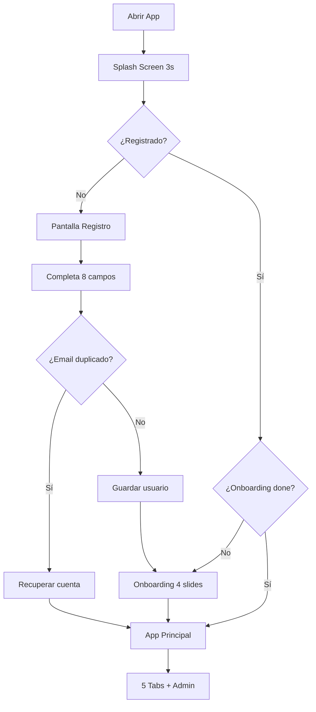
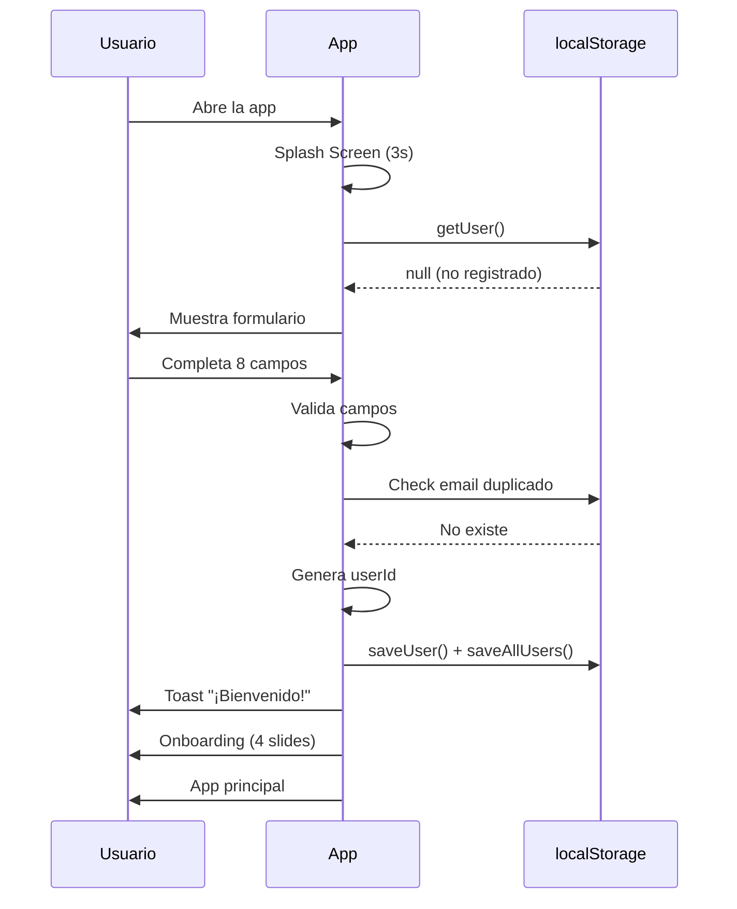
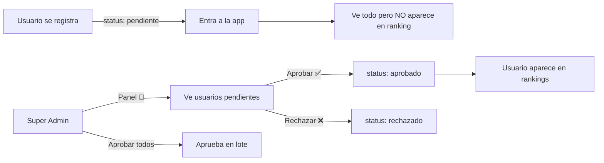
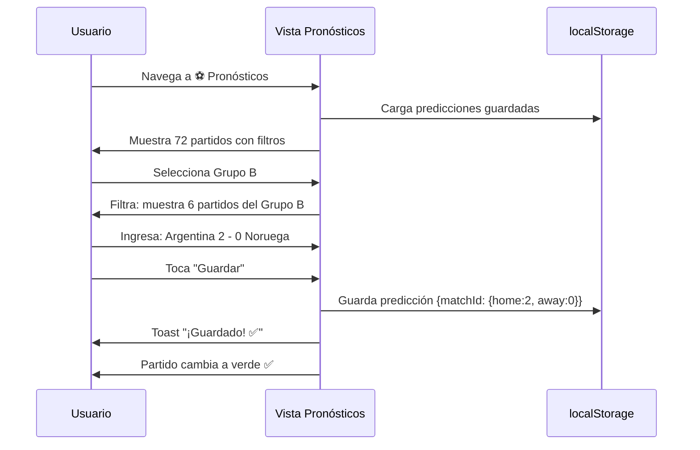
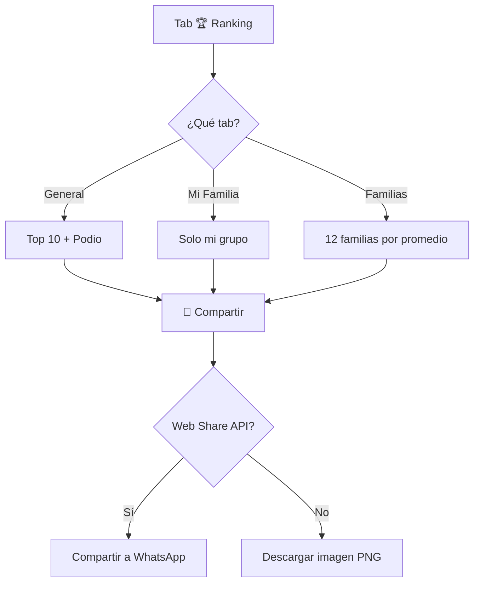
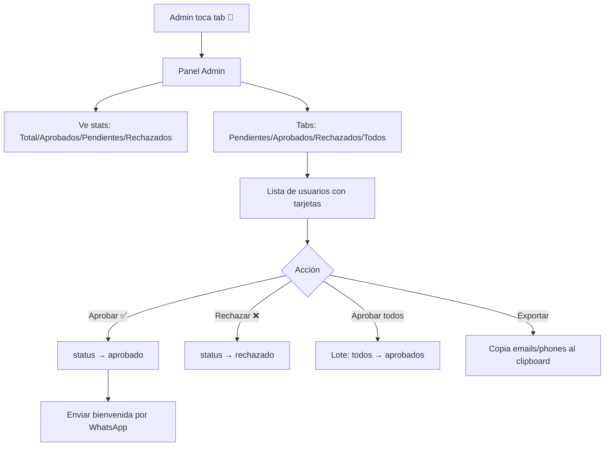

# 🔄 PRODE MUNDIAL 2026 — Flujos de Usuario

## 📱 Diagrama General de Navegación



---

## 1️⃣ Flujo de Registro

### Paso a paso:
```
1. Usuario abre la app por primera vez
2. Ve Splash Screen (🏆 Copa + mascotas, 3 segundos)
3. Se muestra formulario de registro
4. Completa 8 campos obligatorios:
   ├── Nombre
   ├── Apellido
   ├── Apodo (min 3 chars)
   ├── Teléfono
   ├── Email ← PRIMARY KEY
   ├── Grupo familiar (12 opciones)
   ├── Equipo favorito (48 selecciones)
   └── Avatar emoji (20 opciones)
5. Validación de todos los campos
6. Check de email duplicado
7. Si email = santos-dewey@hotmail.com → auto Admin + aprobado
8. Si no → status "pendiente"
9. Genera userId desde email (master key)
10. Guarda en localStorage + allUsers
11. → Onboarding (4 slides)
12. → App principal
```

### Validaciones:
| Campo | Regla |
|-------|-------|
| Nombre | Min 2 caracteres |
| Apellido | Min 2 caracteres |
| Apodo | Min 3 caracteres |
| Teléfono | Min 6 caracteres |
| Email | Contiene @ y . |
| Grupo | Seleccionado |
| Equipo | Seleccionado |
| Avatar | Seleccionado |

### Diagrama:


---

## 2️⃣ Flujo de Aprobación



### Estados de usuario:
| Estado | Puede ver app | Aparece en ranking | Puede cargar pronósticos |
|--------|:---:|:---:|:---:|
| `pendiente` | ✅ | ❌ | ✅ (se guardan local) |
| `aprobado` | ✅ | ✅ | ✅ |
| `rechazado` | ✅ | ❌ | ✅ (local) |

---

## 3️⃣ Flujo de Pronósticos

```
1. Usuario va a tab ⚽ Pronósticos
2. Ve 72 partidos de fase de grupos
3. Filtra por grupo (A-L) o estado (Pendientes/Cargados)
4. Selecciona un partido
5. Ingresa goles (inputs +/- con números grandes)
6. Toca "Guardar" en el partido individual
7. O toca "💾 Guardar Todo" (FAB flotante)
8. Toast: "¡Guardado! ✅"
9. Partido cambia de 🟡 Pendiente a 🟢 Guardado
10. Datos persisten en localStorage
```

### Diagrama:


---

## 4️⃣ Flujo del Bracket de Eliminatorias

```
1. En Pronósticos, scroll abajo de los grupos
2. Ve el bracket visual (32 equipos → Final)
3. Cada slot muestra "1A vs 2D" (placeholder)
4. Toca un slot → modal para elegir ganador
5. Selecciona el equipo que avanza
6. Se completa automáticamente el siguiente round
7. Hasta predecir el campeón
8. Guarda en localStorage('prode-bracket')
```

---

## 5️⃣ Flujo del Ranking



### Rankings disponibles:
| Tab | Datos | Ordenamiento |
|-----|-------|-------------|
| 🏆 General | Todos los aprobados | Por puntos desc |
| 👨‍👩‍👧‍👦 Mi Familia | Solo mi grupo familiar | Por puntos desc |
| ⚔️ Familias | Las 12 familias | Por PROMEDIO desc |

### Emojis de posición:
| Pos | Emoji | Animación |
|-----|-------|-----------|
| 1° | 🏆 | Glow dorado |
| 2° | 🥈 | - |
| 3° | 🥉 | - |
| 4° | 😤 | - |
| 5° | 💪 | - |
| Antepenúltimo | 😰 | - |
| Penúltimo | 🥶 | - |
| **Último** | **💩** | **Shake animation** |

---

## 6️⃣ Flujo de Compartir Rankings (WhatsApp)

```
1. Usuario toca "📸 Compartir Ranking"
2. App genera imagen 1080×1350px con Canvas API
3. Dibuja: fondo oscuro + título dorado + top 10 + footer
4. Convierte a PNG blob
5. Si Web Share API disponible (mobile):
   → navigator.share({ files: [imagen] })
   → Abre selector: WhatsApp, Instagram, etc.
6. Si no disponible (desktop):
   → Descarga automática del PNG
   → Toast: "Imagen descargada"
```

---

## 7️⃣ Flujo del Admin Panel



### Acciones del Admin:
| Acción | Descripción |
|--------|------------|
| ✅ Aprobar | Cambia status a aprobado, usuario aparece en ranking |
| ❌ Rechazar | Cambia status a rechazado |
| ✅ Aprobar todos | Aprueba pendientes en lote |
| 📋 Exportar | Copia todos los emails/teléfonos |
| 📱 WhatsApp | Abre wa.me con mensaje de bienvenida |
| 🔒 Bloquear pronósticos | Toggle global |
| 🗑️ Reset ranking | Con confirmación doble |

---

## 8️⃣ Flujo de Recuperación de Cuenta

```
1. Usuario borró el cache / cambió de dispositivo
2. Ve pantalla de registro
3. Toca "¿Ya tenés cuenta?"
4. Ingresa su email
5. App busca en localStorage('prode-all-users')
6. Si encuentra → restaura sesión
7. Si no encuentra → "Email no encontrado"
```

> ⚠️ **Limitación:** localStorage es por dispositivo. Si el usuario cambia de celular, pierde datos a menos que otro dispositivo tenga el allUsers sincronizado.

---

## 9️⃣ Flujo del Splash Screen

```
1. App se abre
2. Full-screen con:
   - Fondo: gradiente oscuro (#0d1117 → #1a1f36)
   - 🏆 Copa dorada (120px, animación pulse + glow)
   - "PRODE MUNDIAL" en dorado
   - "2026" con efecto shimmer
   - 🇲🇽 México • 🇺🇸 USA • 🇨🇦 Canadá
   - Barra de carga animada
3. Duración: 3 segundos
4. Fade-out suave → Registro o App
```

---

## 🔟 Flujo de "¿Sabías que?"

```
1. Usuario entra al Home
2. Ve tarjeta "¿SABÍAS QUE?" con dato aleatorio
3. Dato mostrado de 150 en la base
4. Categorías: Pelotas | Campeones | Jugadores | Curiosidades | Argentina | Historia | Récords | Países
5. Toca "Otro dato →" → siguiente dato aleatorio
6. Puede compartir el dato por WhatsApp
```

---

## 📱 Navegación Principal

### Mobile (bottom tabs, 5):
```
🏠 Inicio | ⚽ Pronósticos | 🏆 Ranking | 📊 Stats | ⚙️ Más
```

### Desktop (sidebar, +768px):
```
Sidebar izquierda con:
🏠 Inicio
⚽ Pronósticos
🏆 Ranking
📊 Stats
⚙️ Más
🔑 Admin (solo admin)
```

### Router (hash-based):
| Hash | Vista |
|------|-------|
| `#inicio` | Home con countdown + datos |
| `#pronosticos` | 72 partidos + bracket |
| `#ranking` | Triple ranking + podios |
| `#stats` | Estadísticas + tablas |
| `#mas` | Perfil + config + más |
| `#admin` | Panel admin (solo admin) |
